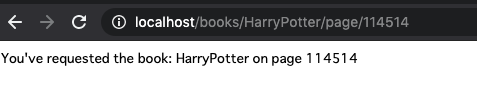
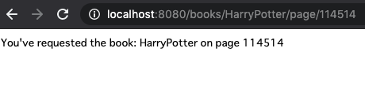

# Routing

[https://gowebexamples.com/routes-using-gorilla-mux/](https://gowebexamples.com/routes-using-gorilla-mux/)

Goのnet/httpパッケージにはHTTPプロトコルのための機能が豊富にあります。ただ、複雑なリクエストルーティングに関しては上手く扱えない。例えば、リクエストURLの中にパラメータを埋め込むなど。  
幸運なことに、そのための非常に人気のパッケージがある。そのパッケージは、Goコミュニティの中では、コードの品質が良いことで知られている。  
この例では、`gorliia/mux`パッケージを使って、名前付きパラメータ付きのルーティングを作成していく。元のページには無いが、`go-chi/chi`を使って実装する場合も述べる。

## Installing the gorilla/mux package and the go-chi/chi package

`gorilla/mux`はGoのデフォルトのHTTPルーターに適応するパッケージ。Webアプリケーションを書くときに生産性を向上させるような多くの機能も付いている。  
Goのデフォルトのリクエストハンドラ（`func (w http.ResponseWriter, r *http.Request)`）の形にも準拠している。そのため、他のHTTPライブラリと混ぜて使うことができる。  
`go get`コマンドで取得する。

```go
go get -u github.com/gorilla/mux
```

`go-chi/chi`は、軽量かつ動作が速いルーター。
[https://github.com/go-chi/chi](https://github.com/go-chi/chi)

```go
go get -u github.com/go-chi/chi
```

## Creating a new Router

まず、リクエストルータを作成する。このルーターはウェブアプリケーションを主たるルーターであり、後にServerにパラメータとして渡されます。すべてのHTTPコネクションを受け取り、そのコネクションを後に登録するリクエストハンドラに渡す。

```go
r := mux.NewRouter()
```

```go
r := chi.NewRouter()
```

## Registering a Request Handler

新しくルーターを作成すると、あとは標準パッケージと同じようにリクエストハンドラを登録できる。ただ、一点違うのは、`http.HandleFunc(...)`の代わりに`r.HandleFunc(...)`のように、routerのメソッドとして呼び出す。  

chiの場合は、標準パッケージと違い、対応するHTTPメソッドを明確にする。`r.Get(...)`のように。

## URL Parameter

`gorilla/mux`ルータの大きな強みは、パスパラメータ取得ができること。例えば、下記のようなURLがあるとする。

```go
/books/go-programming-blueprint/page/10
```

このURLは2つの動的なセグメントがある。

* 本のタイトル（go-programming-blueprint）
* ページ数（10）

上記のURLにリクエストハンドラをマッチさせるためには、次のようにURLパターンの中の動的セグメントをプレースホルダーに置き換えます。

```go
r.HandleFunc("/books/{title}/page/{page}", func(w http.ResponseWriter, r *http.Request) {
    // get the book
    // navigate to the page
})
```

データをそれらのセグメントから取得するときには、引数に`http.Request`を取り、セグメントをmapで返す`mux.Vars(r)`を利用します。

```go
func(w http.ResponseWriter, r *http.Request) {
    vars := mux.Vars(r)
    vars["title"] // the book title slug
    vars["page"] // the page
}
```

go-chiでは下記のようになります。

```go
r.Get("/books/{title}/page/{page}", func(w http.ResponseWriter, r *http.Request) {
    chi.URLParam(r, "title") // the book title slug
    chi.URLParam(r, "page") // the page
})
```

## Setting the HTTP server’s router

`http.ListenAndServe(":80", nil)`の`nil`を疑問に思ったことはない？`nil`だとメインのルーターとしてデフォルトのものを使うという意味になる。自身で作成したルーターを利用するためには、`nil`の代わりにルータの変数`r`を渡してあげればよい

```go
http.ListenAndServe(":80", r)
```

gorilla側のポートへアクセス


chi側のポートへアクセス
