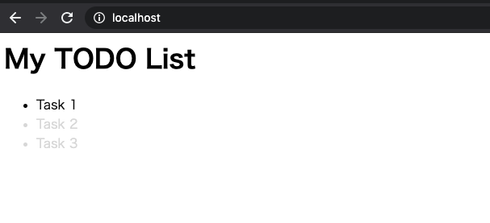

# Templates

[https://gowebexamples.com/templates/](https://gowebexamples.com/templates/)

## Introduction

`html/template`パッケージはHTMLテンプレートのためのリッチな機能を提供する。これはクライアントのブラウザ上に構造化されたデータを表示するWEBアプリケーションの殆どで使われている。Goのtemplatingを使うことで自動的にデータをエスケープしてくれるという大きな恩恵を受けられる。XSS攻撃について心配する必要はない。なぜなら、ブラウザに表示する前にGoはHTMLテンプレートをパースし、すべての入力をエスケープするからである。

## First Template

templateをGoで書くのはとてもシンプルだ。下記の例は、HTML内の順序付けされていないリストによって表現されたTodoリストだ。  
テンプレートをレンダリングするときに、Goのデータ構造の中の何らかの種類のものが渡される。それは単純に文字列や数字であったり、下記のようなネスト化されたデータ構造でも良い。  
テンプレート内で変数にのトップレベルにアクセスするときに使われるのが、`{{.}}`。中括弧の中のドットは、パイプラインやデータのルートエレメントと呼ばれる。

```go
data := TodoPageData{
    PageTitle: "My TODO list",
    Todos: []Todo{
        {Title: "Task 1", Done: false},
        {Title: "Task 2", Done: true},
        {Title: "Task 3", Done: true},
    },
}
```

```html
<h1>{{.PageTitle}}</h1>
<ul>
    {{range .Todos}}
        {{if .Done}}
            <li class="done">{{.Title}}</li>
        {{else}}
            <li>{{.Title}}</li>
        {{end}}
    {{end}}
</ul>
```

## Control Structures

テンプレート機能は、HTMLをレンダリングするための豊富な制御構造を持っています。よく使われるものの概要が下記。詳しくは[https://golang.org/pkg/text/template/](https://golang.org/pkg/text/template/)

|Control Structure|Definition|
|---|---|
|`{{/* a comment */}}`|コメントを定義できる|
|`{{.}}`|ルートエレメントをレンダリングする|
|`{{.Title}}`|ネストした"Title"フィールドをレンダリングする|
|`{{if .Done}} {{else}} {{end}}`|Ifステートメント|
|`{{range .Todos}} {{.}} {{end}}`|"Todos"をループして、それぞれの要素をレンダリングしている|
|`{{block "content" .}} {{end}}`|"content"という名前でブロックを定義|

## Parsing Templates from Files

テンプレートは文字列もしくはディスク上のファイルからパースできる。通常、テンプレートはディスクから読み込ませるため、ここでもそれを例示します。Go Programが同じディレクトリにいる場合の例です。

```go
tmpl, err := template.ParseFiles("layout.html")
// or
tmpl := template.Must(template.ParseFiles("layout.html")) // 失敗したらpanicで落ちる
```

## Execute a Template in a Request Handler

ディスクからテンプレートをパースできたら、リクエストハンドラで使用する準備も完了です。`Execute`関数は2つの引数を取ります。一つ目はテンプレートを書き出す先（io.Writer実装）、2つ目はテンプレートに渡すデータとなります。  
もし、`http.ResponseWriter`を引数に渡していたら、HTTPヘッダには自動的に`Content-Type: text/html; charset=utf-8`がセットされます。

